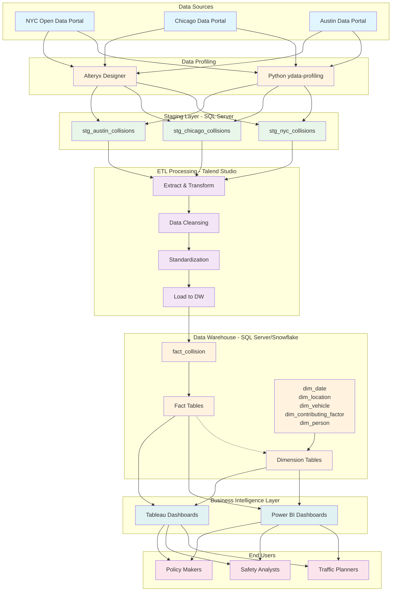

# **CrashStat: Motor Vehicle Collision Analysis**

CrashStat analyzes motor vehicle collision data from New York, Chicago, and Austin to identify accident patterns, risk factors, and safety insights. The project implements a complete data warehouse solution with ETL pipelines and interactive dashboards to answer critical questions about traffic safety.

---

## **Objectives**

### **Analytical Goals**
- Quantify accident volumes across three cities
- Identify top high-risk areas and most fatal locations
- Analyze injury and fatality statistics by city
- Assess pedestrian involvement and safety
- Examine temporal patterns (time of day, day of week, seasonality)
- Identify common contributing factors

### **Technical Goals**
- Integrate and standardize data from three city datasets
- Build scalable ETL pipelines using Talend
- Design star schema dimensional model
- Implement SCD Type 2 for historical tracking
- Create interactive dashboards in Power BI and Tableau

---

## **Data Sources**

### **New York City**
[NYC Crash Report Data | NYC Open Data](https://data.cityofnewyork.us/Public-Safety/Motor-Vehicle-Collisions-Crashes/h9gi-nx95/about_data)

### **Chicago**
[Chicago Crash Report Data | City of Chicago Data Portal](https://data.cityofchicago.org/Transportation/Traffic-Crashes-Crashes/85ca-t3if/about_data)

### **Austin**
[Austin Crash Report Data | City of Austin](https://data.austintexas.gov/Transportation-and-Mobility/Austin-Crash-Report-Data-Crash-Level-Records/y2wy-tgr5/about_data)

---

## **Architecture**



```
Raw Data → Data Profiling → Staging (SQL Server) → ETL (Talend) → 
Dimensional Model → BI Dashboards (Power BI/Tableau)
```

### **Dimensional Model**
- **Fact Table**: `fact_collision`
- **Dimensions**: `dim_date`, `dim_location`, `dim_vehicle`, `dim_contributing_factor`, `dim_person`
- **Features**: Star schema, SCD Type 2, surrogate keys, audit columns

---

## **Implementation**

### **Phase 1: Data Profiling and Staging**
- Profiled data using Python (ydata-profiling) and Alteryx
- Identified quality issues: missing values, inconsistent formats, duplicates
- Created staging tables with audit columns in SQL Server

### **Phase 2: ETL Pipeline and Integration**
- Built ETL workflows in Talend Studio
- Standardized, cleansed, and transformed data
- Loaded dimensional model with SCD Type 2 implementation
- Validated data integrity with SQL queries

### **Phase 3: Business Intelligence**
- Developed dashboards in Power BI and Tableau
- Created interactive visualizations for all analytical goals
- Implemented drill-down and filtering capabilities

---

## **Dashboard**

### **1. Overview and Temporal Analysis**
Displays total accident counts by city (3.04M total), severity breakdown (4,964 injuries, 893K total injury count), and time-based analysis showing seasonal trends. The central visualization reveals peak accident periods throughout the year with injury vs. fatal comparisons.


---

### **2. Geographic and Pedestrian Analysis**
Features an interactive map highlighting collision hotspots across the three cities, motor vehicle deaths and injuries by location, and pedestrian accident trends over time. Shows concentration of accidents in urban centers and tracks pedestrian involvement patterns.


---

### **3. Contributing Factors Analysis**
Comprehensive breakdown of the most common contributing factors leading to accidents. Lists top causes including driver inattention, failure to yield, and following too closely. Shows accident counts by data source and identifies the top 5 street names with highest accident frequency (1,695 motor vehicle deaths, 466K person vehicle injuries).


---

## **Technologies Used**

| Category | Technologies |
|----------|-------------|
| **Data Profiling** | Python (ydata-profiling), Alteryx |
| **ETL** | Talend Studio |
| **Database** | SQL Server, Snowflake |
| **Visualization** | Power BI, Tableau |
| **Version Control** | Git, GitHub |

---

## **Future Enhancements**
- Real-time data integration with streaming pipelines
- Predictive analytics using machine learning models
- Advanced geospatial analysis with road network data
- Mobile dashboard access for field personnel
- Automated alerting for abnormal accident patterns
- Multi-city expansion for broader analysis
- Weather API integration for real-time correlation

---

## **Project Repository**
[CrashStat on GitHub](https://github.com/dhirthacker7/CrashStat_Motor_Vehicle_Collision_Analysis)
